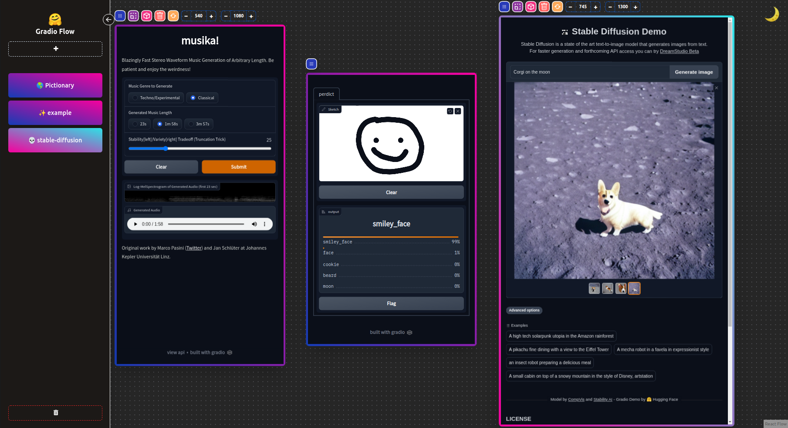
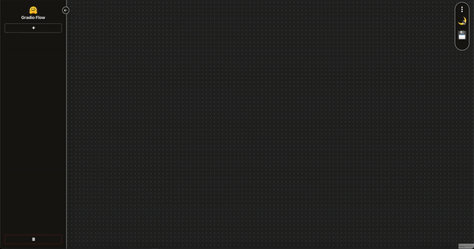
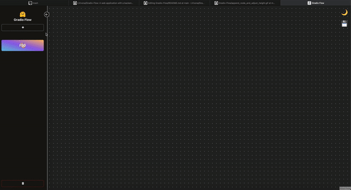
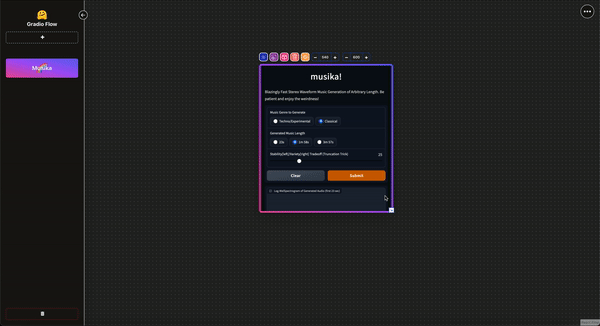
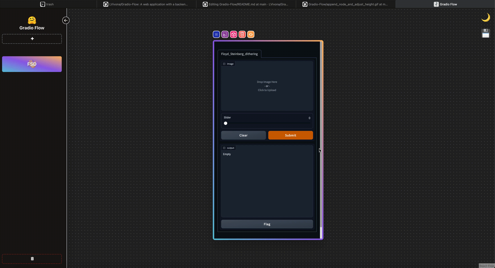
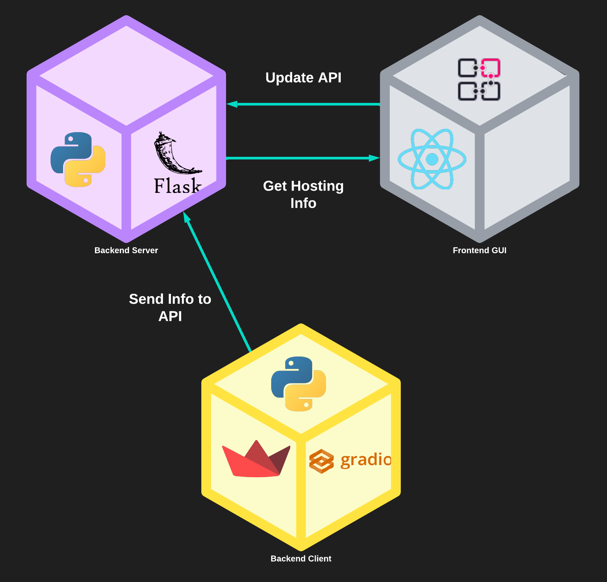

<div position="absolute" align="center">
<h1 style="">Gradio Flow </h1>
</div>
 


## 👋 Reach Me For Inquiry or Bugs

```console
@Discord-Server: Hugging Face https://discord.com/invite/feTf9x3ZSB
@Discord-Name : Luca Vivona
```

## What Is Gradio Flow
**A web application with a backend in [Flask](https://flask.palletsprojects.com/en/2.2.x/) and frontend in [React](https://reactjs.org), and  [React flow](https://reactflow.dev/) node base environment to
stream both [Gradio](https://gradio.app) ( and later [Streamlit](https://streamlit.io) ) interfaces, within a single application.**
 
 
## Tabel Of Contents 📚
 - [**Application**](#application-%EF%B8%8F)


    - [**Features**](#features-)


      - [**Light/Dark Mode**](#lightdark-mode--%EF%B8%8F)  


      - [**Append Node**](#append-node-)
      
      
      - [**Resize Node**](#resize-node-)
      
      
      - [**Delete Node**](#delete-node-%EF%B8%8F)
      
      
      - [**Remove Node From Dashboard**](#remove-node-from-dashboard-)


 - [**Updates**](#updates-%EF%B8%8F)
    
    
    - [**Backend**](#backend-)
    
    
    - [**Frontend**](#frontend-%EF%B8%8F)
    
    
    - [**In The Works**](#in-the-works-)

 - [**App Architecture**](#app-architecture-%EF%B8%8F)
 
 - [**Prerequisites**](#prerequisites-)
 
 - [**Running The App**](#running-the-app-%EF%B8%8F)
 
   - [**Makefile Run**](#makefile-run-docker-)

    
     - [**Running the docker container**](#1-running-the-docker-container)
    
    
     - [**Entering the backend enviorment**](#2-entering-the-backend-enviorment)
    
    
     - [**Appending Nodes To Frontend From The Backend**](3-appending-nodes-to-frontend-from-the-backend)
   
   
   - [**Non-Docker Build**](#non-docker-build)
   
   
     - [**Build frontend**](#1-build-frontend-within-the-directory-frontend)
    
    
     - [**Run frontend**](#2-run-frontend-within-the-directory-frontend)
    
    
     - [**Build backend dependency**](#3-build-backend-dependency-within-the-directory-backend)
    
    
     - [**Build backend**](#4-run-backend-within-the-directory-backend)
    
    
     - [**Run Gradio within Gradio-Flow**](#5-run-gradio-within-gradio-flow)
 
 - [**More Demos**](#more-demos-)
 


## Application 🏛️



## Features 🌐

### Light/Dark Mode 🌕 ☀️


### Append Node ➕


### Resize Node 📏


### Delete Node 🗑️


### Remove Node From Dashboard 🚮


## Updates ⚒️
### Backend 💽
- [ ] Bug fixes for max_thread when launching gradio

### Frontend 🖥️
- [ ] Node
    - [ ] Append edges together (**removed for now**)
        - [ ] (In the works) Connection API paramters; Allow people to use Gradio Flow as a module base platform
    - [ ] within firefox draggable size change not availible due to code error (FIXED)
    - [ ] more responsive size adjuster
    - [ ] converted custom node from class component to functional react component

- Node Menu
    - [ ] fixed some bugs from ``+ button`` for catching errors and wrong inputs
    - [ ] ``+ button`` now includes hugginface spaces, and gradio share
        - [ ] https://hf.space/embed/name_of_user/name_of_space/+
        - [ ] Examples: (https://hf.space/embed/marcop/musika/+, https://hf.space/embed/stabilityai/stable-diffusion/+)
        - [ ] better user interface for shared links


### In The Works 🚧
- [ ] Mutiple windows within the react-flow environment 
- [ ] Directory tree search that looks for files that contain classes and functions that are registered under the decorators that are in ``backend/src/resources`` allowing you to append all your registered functions with only using the frontend.
- [ ] Convert Flask API to FastAPI to complement new feture that allow user so add gradio endpoints (In the works)


 ## App Architecture 🏗️

 
## Prerequisites 📝
You will need:
(Docker build 🐳 Currently Only on: Linux/Windows/Mac)
- [🐳  Docker](https://docs.docker.com/get-docker/)
- [🐋 Docker Compose](https://docs.docker.com/compose/install/) (included with Docker Desktop on Windows and macOS)
 
(Running Without docker)
- 🐍 Python 3.2+ (backend)
- npm 8.5.0 (frontend)
- node v16.14.2 (frontend)
## Running The App 🖥️
 
Starting up it's simple as every command is already within the Makefile.
 
### Makefile Run (Docker 🐳)
#### **1.** Running the docker container
```console
make up
// command running: docker-compose up -d --remove-orphans;
// **Ubuntu** sudo make up
```
The React application will be running on ``http://localhost:3000`` and the Flask will be running on ``http://localhost:2000``
#### **2.** Entering the backend enviorment
```console
make environment
// command running: docker exec -it backend bash;
// **Ubuntu** sudo make environment
```
Now that you're within the docker backend container environment you can start adding gradio/streamlit nodes within the frontend. (**Extra Note**) You do not need to be within the container environment to append nodes there is a feature to just run your own gradio application and then append it within the frontend by using the **+ button**. 
 
#### **3.** Appending Nodes To Frontend From The Backend

```console
> cd ./src/demo
> python demo.py -l 2000
//run example gradio application
```

### Non-Docker Build

#### **1.** Build Frontend (within the directory ``./frontend``)
```console
npm install
```
#### **2.** Run Frontend (within the directory ``./frontend``)
```console
npm start
```

#### **3.** Build Backend Dependency (within the directory ``./backend``)
```console
pip install -r requirements.txt
```

#### **4.** Run Backend (within the directory backend)

```console
python app.py -p 2000
//**NOTE** -p 2000 just assignes it localhost port 2000 anyother port will not work
```
#### **5.** Run Gradio within Gradio-Flow 
It is quite simple, and similar within the docker build, the first way you can append your gradio to the Gradio flow is through running your application at a reachable url that is provided ed when you run Gradio and appending it via ``+ button`` within the frontend, another way that is possible is that within the directory ``./backend/src/resources`` there is a code that you can use to convert your own class or functional  base code into basic gradio tabular interface by using decorators, these decorators will send the nesarry information to the backend flask api and update the frontend menu state in which you'll will be able to interact with it within the front end creating a hub for gradio build functions(**read more** [**here**](https://github.com/LVivona/GradioWrapper) or look at the code [**here**](https://github.com/LVivona/Gradio-Flow/blob/main/backend/src/resources/module.py) ).

**NOTE** If you use the gradio decorator compiler for gradio flow you need to set a listen port to 2000 or else the api will never get the key and will throw you an error, I'll also provided an example below if this isn't clear.

```python
# (functional base)
##########
from resources import register, tabularGradio

@register(["text"], ["text"], examples=[["Luca Vivona"]])
def Hello_World(name):
        return f"👋 Hello {name}, and welcome to Gradio Flow 🤗" 

if __name__ == "__main__":
    # run single gradio
    tabularGradio([Hello_World])  # tabularGradio([Hello_World], ["Greeting"])

    # run it within Gradio-Flow
    # tabularGradio([Hello_World], listen=2000) # tabularGradio([Hello_World], ["Greeting"], listen=2000)
    
```

```python
#(Class Base)
###########
from resources import GradioModule, register

@GradioModule
class Greeting:

    @register(["text"], ["text"], examples=[["Luca Vivona"]])
    def Hello_World(self, name):
        return f"👋 Hello {name}, and welcome to Gradio Flow 🤗" 

if __name__ == "__main__":
    # run just gradio
    Greeting().launch()
    # run it within Gradio-flow
    # Greeting().launch(listen=2000)
```

# More Demos ➕
Within the ``backend/src/demo`` directory there are some demos
```command
# type : class | function | load | None
# port : 2000 | None 
# python demo.py -e [type] -l [port]
(e.g)
> python demo.py -e class -l 2000
> python demo.py -e class
```
